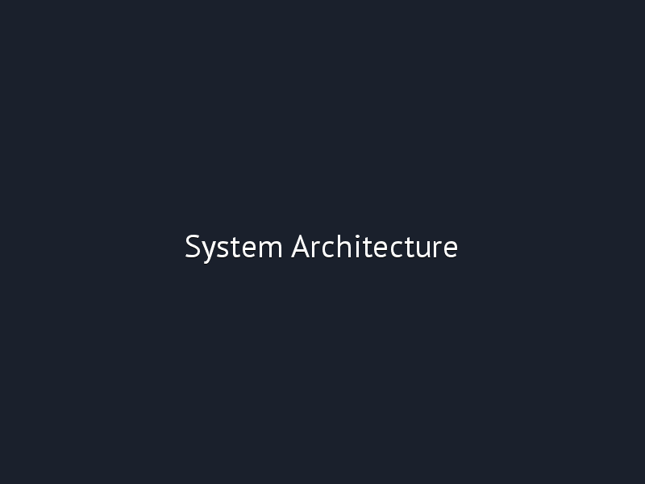

# Agentic AI Blockchain Simulator 🤖⛓️

> **A groundbreaking simulation of multi-agent AI systems operating on a decentralized blockchain network.**
> *Proof-of-Concept for the future of autonomous, coordinated AI economies.*

[](https://opensource.org/licenses/MIT)
[](https://www.python.org/downloads/)
[](https://nodejs.org/)
[](CONTRIBUTING.md)

## 🎯 Vision

**What if AI agents could participate in decentralized economies?** This project explores the convergence of autonomous AI systems and blockchain technology through a fully functional simulation.

We're building the foundational framework for a future where:
- 🤖 AI agents can autonomously make predictions, validate data, and execute transactions
- ⛓️ Blockchain provides trust, transparency, and economic incentives for AI coordination
- 📊 Complex multi-agent systems can be tested and optimized in simulated environments
- 🌐 Decentralized AI networks can emerge with built-in governance and reward mechanisms

## 🚀 Quick Start

### Prerequisites
```bash
python >= 3.8
node.js >= 16
npm or yarn
```

### Installation & Run
```bash
# Clone the repository
git clone https://github.com/your-username/agentic-ai-blockchain-sim.git
cd agentic-ai-blockchain-sim

# Install dependencies
cd ai-agents && pip install -r requirements.txt
cd ../frontend && npm install
cd ../api && npm install

# Start the simulation (in separate terminals)
# Terminal 1: Start the mock blockchain API
cd api && npm run dev

# Terminal 2: Start the AI agent system  
cd ai-agents && python main.py

# Terminal 3: Start the frontend dashboard
cd frontend && npm start
```

Visit `http://localhost:3000` to see the live simulation dashboard!

## 🏗️ Architecture Overview


## ✨ Key Features

### 🤖 Multi-Agent Intelligence
- **Specialized Agents**: Four distinct AI agents with unique roles and capabilities
- **LangGraph Coordination**: Sophisticated workflow management for agent collaboration
- **Autonomous Decision Making**: Agents analyze data and make independent decisions
- **Learning & Adaptation**: Performance tracking and continuous improvement

### ⛓️ Blockchain Simulation
- **Smart Contract Ecosystem**: Simulated prediction markets, agent registry, and reward systems
- **Transaction Lifecycle**: Complete mock of blockchain interaction patterns
- **Event-Driven Architecture**: Real-time updates and agent triggering
- **Economic Incentives**: Token rewards and performance-based compensation

### 📊 Live Demonstration
- **Real-time Dashboard**: Monitor agent activity, predictions, and performance
- **Transaction Explorer**: View simulated blockchain transactions and events
- **Agent Analytics**: Track accuracy, efficiency, and economic impact
- **Scenario Testing**: Multiple predefined and custom test scenarios

## 🎮 Demo Scenarios

### Scenario 1: Decentralized Prediction Market
```
1. DataAnalysisAgent processes market data
2. PredictionAgent generates price forecasts
3. ValidationAgent cross-checks predictions
4. ExecutionAgent submits to prediction market
5. Rewards distributed based on accuracy
```

### Scenario 2: Multi-Agent Validation System
```
1. Multiple PredictionAgents generate independent forecasts
2. ValidationAgent identifies consensus and outliers
3. Reputation scores updated based on performance
4. Higher-reputation agents receive more weight
```

### Scenario 3: Autonomous Economic Agent
```
1. Agent monitors multiple data streams
2. Identifies arbitrage opportunities
3. Executes simulated trades
4. Reinvests profits and optimizes strategy
```

## 📁 Repository Structure

```
agentic-ai-blockchain-sim/
├── 📁 docs/                          # Comprehensive documentation
│   ├── PROBLEM_STATEMENT.md          # The vision and market opportunity
│   ├── ARCHITECTURE.md               # Technical architecture deep dive
│   ├── USE_CASES.md                  # Business applications and scenarios
│   └── FUTURE_ROADMAP.md             # Path to production implementation
├── 📁 smart-contracts/               # Blockchain simulation layer
│   ├── contracts/                    # Solidity smart contracts
│   ├── scripts/                      # Deployment and interaction scripts
│   ├── test/                         # Comprehensive test suite
│   └── hardhat.config.js             # Development environment
├── 📁 ai-agents/                     # Agentic AI system
│   ├── multi_agent_system/           # Core agent implementations
│   ├── tools/                        # Custom tools for blockchain interaction
│   ├── examples/                     # Demo scenarios and use cases
│   └── requirements.txt              # Python dependencies
├── 📁 frontend/                      # React dashboard
│   ├── src/
│   │   ├── components/               # Dashboard components
│   │   ├── pages/                    # Main views
│   │   └── utils/                    # API clients and helpers
│   └── public/
├── 📁 api/                           # Mock blockchain API
│   ├── server.js                     # Express.js server
│   ├── routes/                       # API endpoints
│   └── models/                       # Data models
└── 📁 demo-screenshots/              # Project visuals
```

## 🛠️ Technology Stack

**AI Agent Layer**
- 🐍 Python 3.8+
- 🤖 LangGraph + LangChain for agent orchestration
- 📊 Various ML libraries for data analysis
- 🔧 Custom tool development for blockchain interaction

**Blockchain Simulation**
- ⚡ Node.js + Express for mock API
- 📜 Solidity for smart contract design patterns
- 🧪 Hardhat for development and testing
- 🔗 Web3.js for blockchain interaction

**Frontend & Visualization**
- ⚛️ React.js for dashboard
- 📈 Chart.js for analytics
- 🎨 Tailwind CSS for styling
- 🔄 Socket.io for real-time updates

## 🎯 Use Cases & Applications

### Financial Markets
- Autonomous trading agents
- Risk assessment and prediction
- Portfolio management algorithms

### Supply Chain & Logistics
- Predictive inventory management
- Route optimization agents
- Demand forecasting systems

### Research & Development
- Scientific discovery coordination
- Multi-agent problem solving
- Distributed computation markets

### Gaming & Metaverse
- NPC economies and interactions
- Virtual asset management
- Dynamic world simulation

## 🤝 Contributing

We believe the future of AI and blockchain is collaborative! Here's how you can contribute:

1. **Fork** the repository
2. **Create** a feature branch (`git checkout -b feature/amazing-feature`)
3. **Commit** your changes (`git commit -m 'Add some amazing feature'`)
4. **Push** to the branch (`git push origin feature/amazing-feature`)
5. **Open** a Pull Request

See our [Contributing Guidelines](CONTRIBUTING.md) for more details.

### Good First Issues
We've tagged several issues as `good-first-issue` for new contributors:
- Add new agent types
- Create additional demo scenarios
- Improve dashboard visualizations
- Enhance simulation realism

## 📈 Project Roadmap

### Phase 1: Core Simulation ✅
- [x] Multi-agent system foundation
- [x] Basic blockchain simulation
- [x] Dashboard interface
- [x] Documentation structure

### Phase 2: Enhanced Realism 🚧
- [ ] More sophisticated economic models
- [ ] Advanced agent decision-making
- [ ] Real-world data integration
- [ ] Performance optimization

### Phase 3: Production Path 🔮
- [ ] Testnet deployment capabilities
- [ ] Cross-chain compatibility research
- [ ] Governance mechanism design
- [ ] Enterprise use case development

## 🏆 Team & Acknowledgments

This project is maintained by SKarthik with contributions from the open-source community.

**Special Thanks To:**
- The LangChain/LangGraph team for incredible AI agent frameworks
- The blockchain developer community for continuous innovation
- Early testers and contributors who helped shape this vision

## 📜 License

This project is licensed under the MIT License - see the file for details.

## 🔗 Links & Resources

- 📚 [Full Documentation](docs/ARCHITECTURE.md)
- 🎥 [Demo Video](docs/demo.mp4) 
- 💡 [Use Cases](docs/USE_CASES.md)
- 🗺️ [Roadmap](docs/FUTURE_ROADMAP.md)
- 🐛 [Issue Tracker](https://github.com/your-username/agentic-ai-blockchain-sim/issues)

## 💬 Get In Touch

Have questions, ideas, or want to collaborate?
- 📧 Email: skarthikak@outlook.com
- 💼 LinkedIn: [Your Profile](https://linkedin.com/in/karthikcse)

---
## 📸 Live Demo & Screenshots

### Dashboard Overview


### System Architecture  


### Live Activity Feed


### Prediction Markets


> **Note**: These are placeholder images. [View interactive mockups](demo-screenshots/) or generate real screenshots from the HTML files.

**⭐ If this project inspires you, please give it a star on GitHub!**

> *"The most powerful technologies emerge when we combine multiple paradigms. AI gives us intelligence, blockchain gives us trust. Together, they create something truly transformative."*
